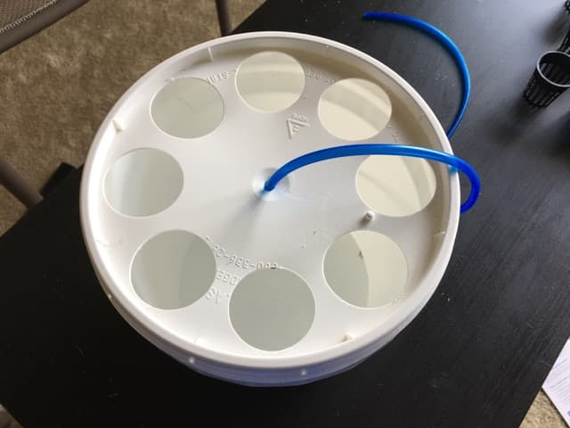
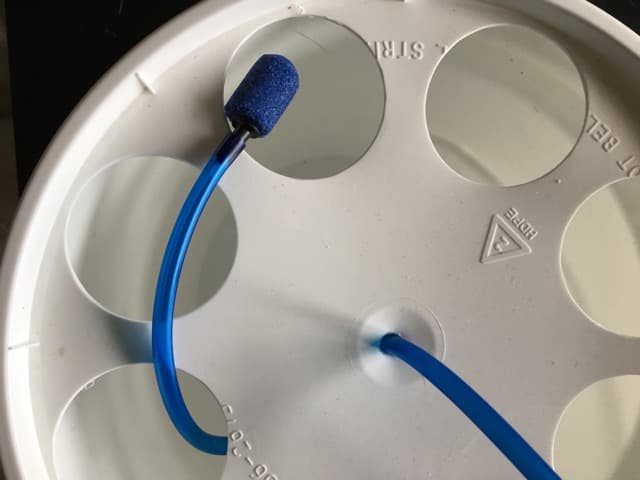
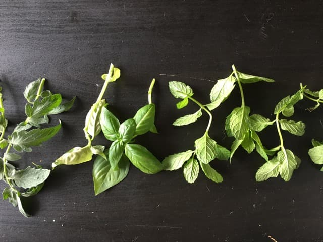
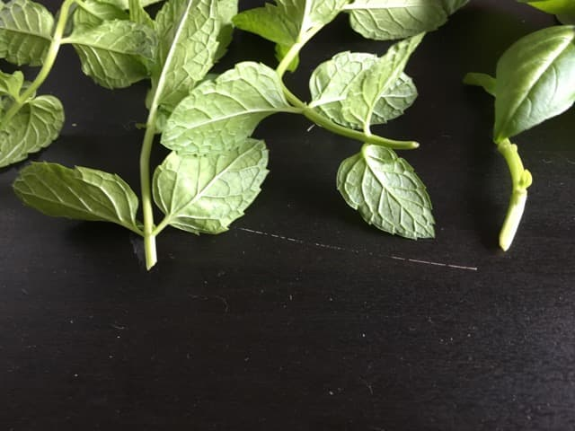
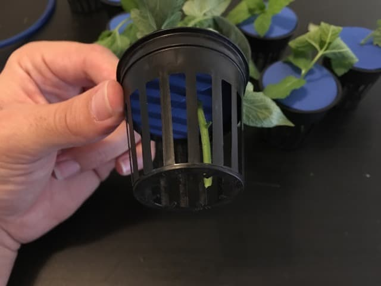
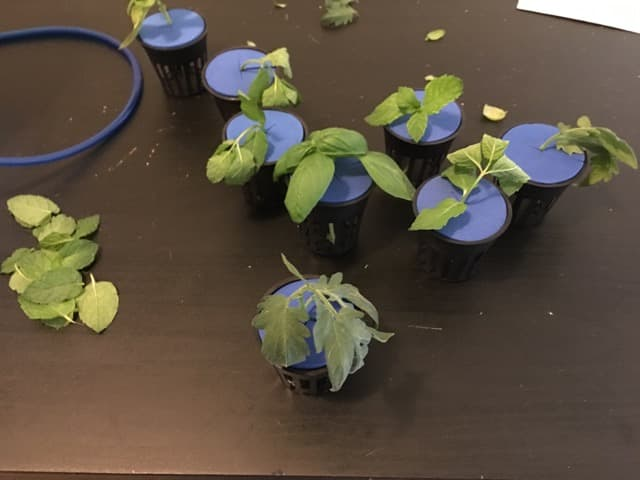
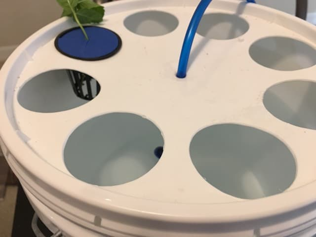
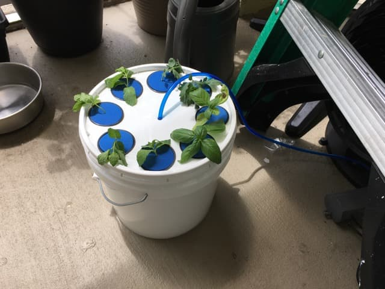

Lately, I've really been getting into gardening. I wanted to start growing some herbs and vegetables to have fresh on hand always (can't have enough mint![^1]). Since you can clone a plant with just a leaf, you can grab a leaf from an already existing plant to begin your collection.

Specifically, for this post, I will walk you through my first attempt at trying to clone multiple soft stem plants. This started when one of my coworkers (I'll call him Robb[^2]) gave me a plant cloner. It's a simple device, consists of only a couple of parts, most of which you can get from your local supermarket/grocery store like Walmart.

### Parts

* [2" Net Cups](https://www.amazon.com/NP2AB-Slotted-Hydroponics-Aquaponics-Orchids/dp/B00I1OCZLY/)
* [2 gallon Plastic Pail](https://www.amazon.com/Encore-Plastics-20256-Industrial-2-Gallon/dp/B00144EO62/)
* [2 gallon Gasket Lid](https://www.amazon.com/Encore-Plastics-52250-White-2-Gallong/dp/B009YNYPCS/)
* [2" Neoprene Net Cup Lids](https://www.amazon.com/dp/B01AAXA6Y6/)
* [Aqua Culture Air Pump - 5-15 gallon Single Outlet](https://www.amazon.com/Gallon-Single-Outlet-Aquarium-Check/dp/B01HNAOYS8/)
* [Aquarium Tube Air Hose](https://www.amazon.com/Uxcell-Soft-Plastic-Oxygen-Black/dp/B00H4WZ3JA/)
* [Aquarium Tube Air Stone](https://www.amazon.com/Yueton-Cylinder-Aquarium-Bubble-Aerator/dp/B01CQ9L9I4/)
* [2" Hole Saw](http://www.lowes.com/pd/LENOX-2-in-Bi-Metal-Arbored-Hole-Saw/3361282) (if you don't have one)

_Note: The links above are just examples, make sure to shop around to get the best possible price. I also didn't individually vet each link/seller, so buy at your own risk. It may be better if you go to a local hydroponics store to grab the necessary items._

_Note 2: Some of these items come with more than you need, it's unfortunate, but it does mean you can make more than one cloner if you want!_

### Making the Cloner

Making the cloner is easy: using the hole saw, around the edge of the gasket lid, cut 8 two inch holes. Try to space them apart evenly, so that all the holes fit (though, it doesn't have to be perfect). Once you are done, it should look something similar to the image below (ignore the hose, for now, my cloner was already completed at the time of the picture).

Once you've got the holes cut, cut a small hole in the middle large enough to fit the air hose that you purchased. Once that is done, thread the hose through the hole, enough to make it to the bottom of the pail (take a look at the above image if you are unsure of what to do).

Next, insert the air stone to the bottom of the hose (the end that's in the pail).

You are now done with creating the cloner. Now you are ready to start cloning!

### Using the Cloner

Now that your cloner is ready to use, it's time to get 8 four inch cuts of the plants you want to clone. I will be using a variety of tomatoes, mint, and basil. Make sure to cut from the top of the plant, on one of the (hopefully) many branches it has (never from the main branch). Also, cut at a 45-degree angle. Take a look at a couple of cuts I did below if you are not sure how to proceed.

Once you have your 8 cuts (it doesn't have to be 8, however, the cloner supports up to 8 plants), strip the leaves at the bottom of the stem (only keep a couple towards the top), and insert them into the net cup lids until they reach the bottom of the net cup.

Next, it's time to fill up the pail full of water! Put one of the net cups into the pail, and fill it up full of water until the water is about 1 inch from the bottom of the net cup.

Now it's time to insert your net cups, connect the air hose to the air pump, plug it into power, and place it near a window! We should start seeing roots grow from our cuts in the next couple of weeks.

[^1]: For mojitos of course!

[^2]: He didn't get my explicit permission to use his real name (though I didn't ask)
